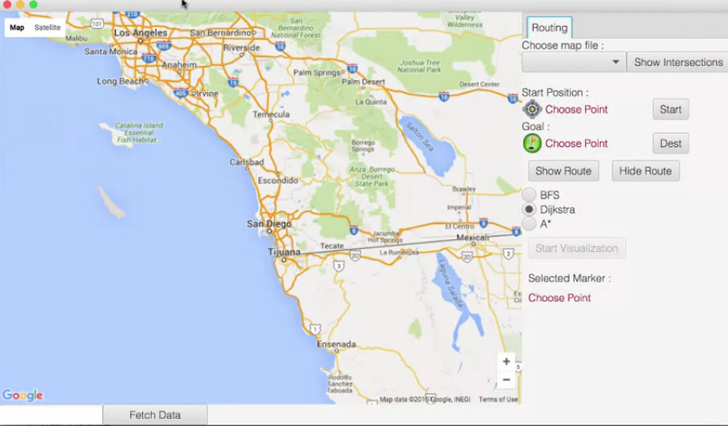

# AdvancedDataStructuresinJava
Coursera description: In this course, you’ll learn about data structures, like graphs, that are fundamental for working with structured real world data.  You will develop, implement, and analyze algorithms for working with this data to solve real world problems. In addition, as the programs you develop in this course become more complex, we’ll examine what makes for good code and class hierarchy design so that you can not only write correct code, but also share it with other people and maintain it in the future. The backbone project in this course will be a route planning application. You will apply the concepts from each Module directly to building an application that allows an autonomous agent (or a human driver!) to navigate its environment.

The teachers of this course already provides a GUI to work with. The idea is to develop the backend of the project. Using graphs and search algorithms like Dijkstra's algorithm, Breadth-first search (BFS) or A* search algorithms, the students will build the code needed to plan routes between diferent nodes in a map.

